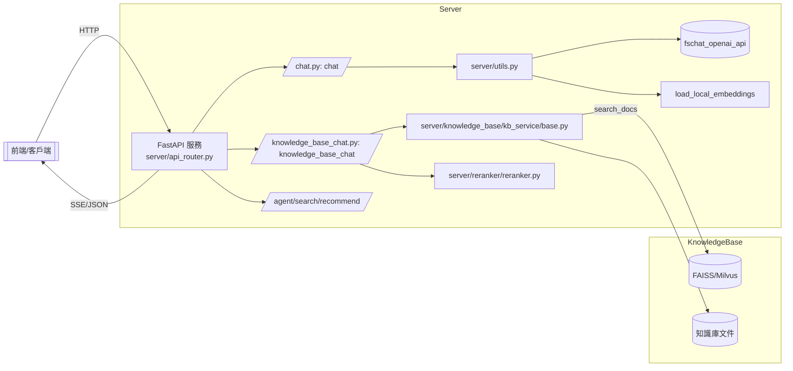
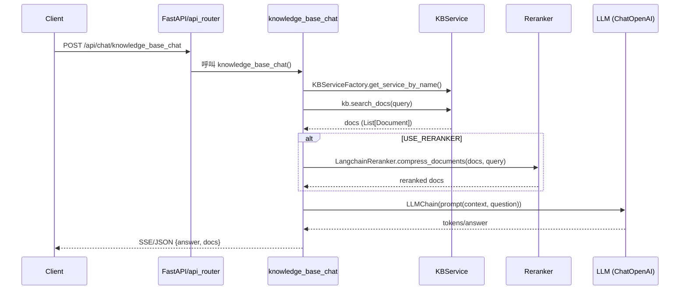

## 專案總覽

本文件基於實際程式碼掃描撰寫，描述本專案的系統架構、資料流與模組/檔案職責。所有說明均以實際存在的檔案與函式為準，避免臆測。

- 專案根：提供 API 服務（FastAPI），對接知識庫檢索（FAISS/Milvus 或本地向量庫）、Reranker、LLM 生成，以及評估/實驗性 RAG pipeline（ragCore）。
- 主要資料流：HTTP 請求 -> FastAPI 路由 -> 業務處理（對話/知識庫/搜索/Agent）-> 召回（向量庫）-> 可選 Rerank -> Prompt 構建 -> LLM 生成 -> SSE/JSON 回傳。

---

## 目錄與職責

- README.md：簡單提供一個 POST 調用示例。
- configs/：統一配置中心，對外以 `configs.__init__` 聚合導出。
  - configs/basic_config.py：全域 logger 與臨時目錄；`LOG_PATH`、`BASE_TEMP_DIR` 等。
  - configs/model_config.py：模型清單/路徑、Reranker 參數、搜尋 TopK、Score 閾值、Agent 支援等常量。
  - configs/server_config.py：HTTP 服務埠、FastChat 組件位址與 device 設置、httpx timeout 等。
  - configs/prompt_config.py：Prompt 模板字典 PROMPT_TEMPLATES（llm_chat / knowledge_base_chat / agent_chat / recommend）。
- server/：對外 API 與服務組裝層。
  - server/api_router.py：建立 FastAPI 應用與路由綁定、掛載前端靜態目錄。
    - 路由：
      - POST /api/chat -> server/chat/chat.py:chat
      - POST /api/chat/knowledge_base_chat -> server/chat/knowledge_base_chat.py:knowledge_base_chat
      - POST /api/chat/search_engine_chat -> server/chat/search_engine_chat.py:search_engine_chat
      - POST /api/chat/recommend_chat -> server/chat/recommendation_chat.py:recommend_base_chat
      - POST /api/chat/agent_chat -> server/chat/agent_chat.py:agent_chat
      - POST /api/conversations -> server/verify/utils.py:create_conversation
      - GET  /api/users/{user_id}/conversations -> server/verify/utils.py:get_user_conversations
      - GET  /api/conversations/{conversation_id}/messages -> server/verify/utils.py:get_conversation_messages
  - server/utils.py：
    - 模型與服務位址：`fschat_openai_api_address()`、`fschat_model_worker_address()`、`fschat_controller_address()`
    - LLM 客戶端：`get_ChatOpenAI()`（基於 langchain_openai.ChatOpenAI，讀取 configs 與 fastchat 位址）
    - 模型配置整合：`get_model_worker_config()`（整合本地/線上配置與 worker）
    - Prompt 存取：`get_prompt_template(type,name)` 從 configs/prompt_config 載入
    - HTTP 客戶端/代理設定：`set_httpx_config()`、`get_httpx_client()`
    - 嵌入模型載入：`load_local_embeddings()`、設備探測：`embedding_device()`
    - 通用回應模型：`BaseResponse`、列表回應：`ListResponse`
  - server/chat/：對話域應用
    - chat.py: `chat()`
      - 參數：query、user_id、conversation_id、history_len、history、stream、model_name、temperature、max_tokens、prompt_name
      - 流程：校驗用戶 -> 建立 message 紀錄 -> 構建 LLM（get_ChatOpenAI）-> 可選從 DB 記憶（ConversationBufferDBMemory）-> LangChain LLMChain -> 透過 AsyncIteratorCallbackHandler SSE 輸出
    - knowledge_base_chat.py: `knowledge_base_chat()`
      - 依 `KBServiceFactory.get_service_by_name()` 取得知識庫實例 -> `search_docs()` 檢索 -> 可選 `LangchainReranker` 重排 -> 拼接 context -> 以 PROMPT_TEMPLATES["knowledge_base_chat"] 構建提示 -> LLMChain 輸出與引用來源回傳
    - 其他檔案（recommendation_chat.py、search_engine_chat.py、agent_chat.py）提供其他對話類型端點（此文僅標註路由，細節依檔案為準）。
  - server/knowledge_base/：知識庫服務
    - kb_doc_api.py：
      - `search_docs(...)`：呼叫 `KBServiceFactory.get_service_by_name()` 後 `kb.search_docs(query)`，回傳 `DocumentWithVSId` 列表（含 score/id）。
      - `upload_docs(...)` / `update_docs(...)` / `delete_docs(...)` / `download_doc(...)` / `recreate_vector_store(...)`：文件維護與向量庫重建流程，依據 `KnowledgeFile` 與 KBService 對應方法。
    - kb_service/：知識庫實作抽象與具體後端（faiss_kb_service.py、milvus_kb_service.py）。
    - kb_cache/：Embedding 緩存與封裝（如 embeddings_pool）。
    - model/kb_document_model.py：`DocumentWithVSId` 數據模型。
  - server/reranker/reranker.py：`LangchainReranker` 基於 `sentence_transformers.CrossEncoder` 對 Document 集合按 query 進行重排，輸出前 top_n。
  - server/embeddings_api.py：提供嵌入向量計算封裝（本地 embeddings 或線上 API）。
  - server/main.py：包含一個 BM25Retriever 範例與基類（與 ragCore 有部分重疊，偏測試/樣例用途）。
- ragCore/：RAG 研究與評估核心（與服務層解耦，供離線/實驗性流程）
  - pipeline/pipeline.py：
    - BasicPipeline：組裝 Evaluator、PromptTemplate、檢索器/生成器接口；evaluate() 寫入與評分
    - SequentialPipeline.run()：批量檢索 `retriever.batch_search` -> prompt -> generator.generate -> evaluate
    - ConditionalPipeline：根據 judge 決定是否走檢索；合併結果再評估
  - retriever/retriever.py：
    - BaseRetriever：快取與重排裝飾器、抽象 _search/_batch_search、cache/rerank 管理
    - BM25Retriever：基於 Pyserini 索引
    - DenseRetriever：基於 FAISS 索引與 Encoder/STEncoder，批量檢索支援
  - generator/generator.py：生成器介面（LLM 調用封裝，結合 configs）
  - evaluator/：評估流程與指標（evaluator.py、metrics.py）
  - dataset/：資料集裝載與切分（dataset.py、utils.py）
  - prompt/base_prompt.py：提示模板封裝
  - utils/utils.py：工廠方法 `get_retriever`/`get_generator`/`get_refiner`/`get_judger` 等
- text_splitter/：中文文本切分（ChineseRecursiveTextSplitter, zh_title_enhance）
- document_loaders/：文檔讀取器（PDF 等）
- scripts/：資料預處理與導入 Milvus/向量庫示例腳本
- static/dist：前端靜態資源（由 Vue 構建）

---

## 系統架構（Mermaid）

---

## 知識庫檢索流程（Mermaid）

---

## 主要檔案與函式定位（節選）

- 路由/啟動
  - server/api_router.py: create_app(), mount_app_routes()
- 對話
  - server/chat/chat.py: chat()
  - server/chat/knowledge_base_chat.py: knowledge_base_chat()
- 知識庫
  - server/knowledge_base/kb_doc_api.py: search_docs(), upload_docs(), update_docs(), delete_docs(), download_doc(), recreate_vector_store()
  - server/knowledge_base/kb_service/base.py: KBServiceFactory（工廠方法）
- Reranker
  - server/reranker/reranker.py: LangchainReranker.compress_documents()
- 模型/工具
  - server/utils.py: get_ChatOpenAI(), get_prompt_template(), get_model_worker_config(), embedding_device()
- RAG Pipeline（研究/評估）
  - ragCore/pipeline/pipeline.py: SequentialPipeline.run(), BasicPipeline.evaluate()
  - ragCore/retriever/retriever.py: DenseRetriever._batch_search() 等

---

## 已知限制與注意事項

- server/main.py 與 ragCore/retriever/retriever.py 中的檢索器程式碼存在重疊與變體（測試/樣例用途），實際線上流程主要走 server/knowledge_base 與 LangChain 檢索接口。
- 多處路徑在示例或注釋中使用了絕對路徑（/root/autodl-tmp/... 或 /data/data/...），部署時需按環境調整 configs/model_config.py 與向量庫位置。
- SSE 回傳格式由 AsyncIteratorCallbackHandler 控制，前端需適配。
- Reranker 依賴 sentence_transformers.CrossEncoder，需對應模型與裝置支援。
- 由於 README 僅展示部分 API，完整行為以 server/api_router.py 及實際程式碼為準。

---

## 後續可優化建議（僅基於現狀）

- 統一檢索器與知識庫接口，避免 server/main.py 與 ragCore 重疊概念造成困惑。
- 抽離硬編碼路徑，集中至 configs 與環境變數。
- 強化單元測試：
  - server/chat/knowledge_base_chat 的 reranker 開關、空結果分支
  - server/utils.get_model_worker_config 的線上/本地模型分支
  - embeddings_api 的本地/線上模型選擇與錯誤處理

